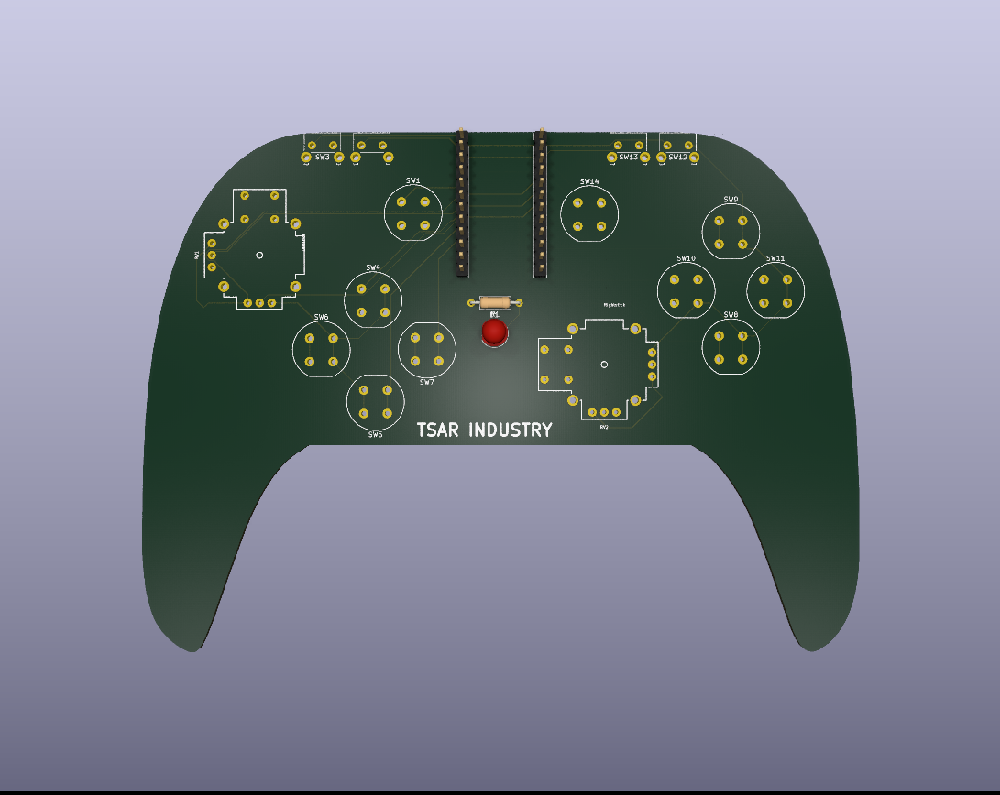

# 🎮 DIY Game Controller PCB

A custom game controller PCB designed in KiCad 10.

## ✨ Features
- ✅ Joystick support
- ✅ Push buttons
- ✅ Compact PCB layout
- ✅ DIY gaming controller design

## 🛠 Software Used
- KiCad 10

## 📦 Project Files
- Schematic
- PCB Layout
- Custom Footprints

## 📷 Preview

## 🚀 Designed By
TSAR INDUSTRY
